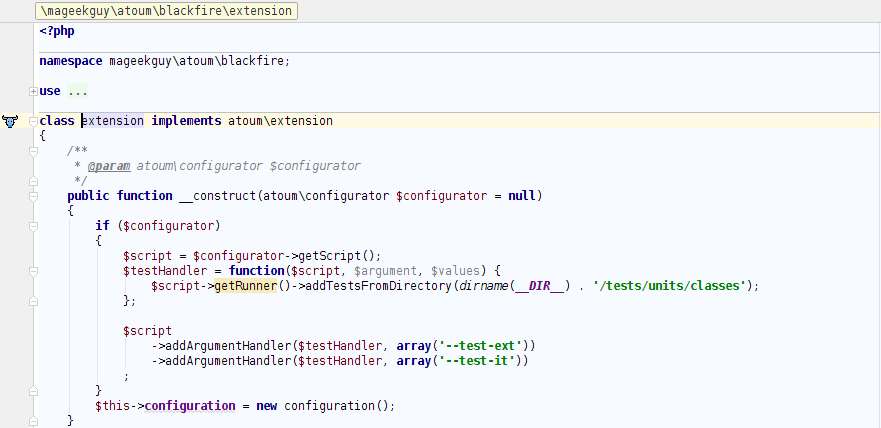

# atoum PhpStorm Plugin

Integrates atoum into PhpStorm.

Features :

* Go to the test class from the tested class (shortcut: alt+shift+K)
* Go to the tested class from the test class (shortcut: alt+shift+K)
* Execute tests inside PhpStorm (shortcut: alt+shift+M)
* Execute all project's test inside PhpStorm (shortcut: alt+shift+V)
* Easily identify test files by a custom icon

## Detailed Features

### Execute tests inside PhpStorm

By an entry on the run menu and on the right click menu.

You can run the tests from both the test file or the tested classe's file.

Your test file and tested file will automatically be save before running the test.

The default keyboard shortcut to execute the test is alt+shift+M.

### Go to the test class from the tested class

From the tested class you can go to the test class by clicking on the icon on the left of the class,

or from a menu entry in navigation,

or by an entry bin the right click menu.

The default keyboard shortcut to switch file is alt+shift+K.

### Go to the tested class from the test class

From the test class you can go to the tested class by clicking on the icon on the left of the class,

or from a menu entry in navigation,

or by an entry bin the right click menu.

The default keyboard shortcut to switch file is alt+shift+K.

You can also run the test on the project view. From here you can launch tests on an entire directory:

### Easily identify test files by a custom icon

Atoum's test files are displayed with a different icon, like that you will easily differentiate them from other PHP files.

### Execute all tests inside PhpStorm

The plugin lets you run all your project's test suites inside PhpStorm. You can run them by selecting "run -> atoum - run all tests" (or with the default keyboard shortcut : alt+shift+V).

atoum will be launched without a directory or file parameter, so, you will need to add something like this in your `.atoum.php` file in order to run all the tests : `$runner->addTestsFromDirectory(__DIR__ . '/tests/units');`.

## Installation

### Inside PhpStorm (recommended)

* Open PhpStorm
* Go to `File -> Settings`, then click on `Plugins`
* Click on `Browse repositories`
* Search for atoum in the list, then click on the install button
* Restart PhpStorm

### Via the jar

* Download the lasted version of the `.jar` on the [releases pages](https://github.com/atoum/phpstorm-plugin/releases)
* Open PhpStorm
* Go to `File -> Settings`, then click on `Plugins`
* Click on the `install from disk` button, then select to downloaded jar
* Restart PhpStorm

## Links

* [PhpStorm](https://www.jetbrains.com/phpstorm/)
* [atoum](http://atoum.org)
* [atoum's documentation](http://docs.atoum.org)

## Licence

atoum phpstorm-plugin is released under the MIT License. See the bundled LICENSE file for details.
